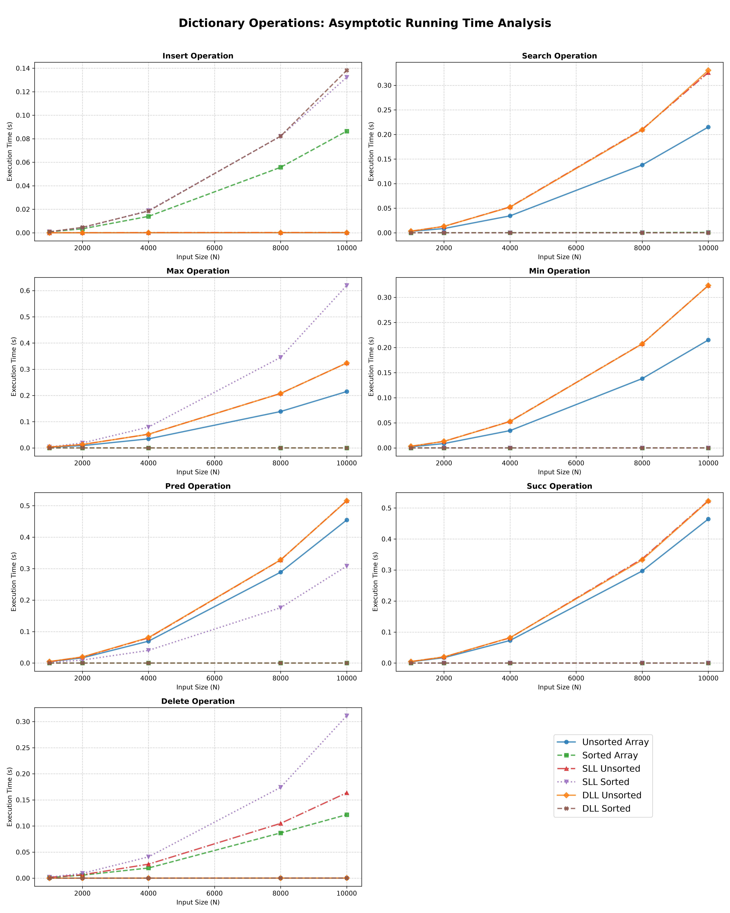

# Lab 2 - Question 1: Dictionary Operations Analysis

## Problem Statement
This project implements and benchmarks seven primary dictionary operations across six different data structures to analyze their asymptotic worst-case running times[cite: 3].

### Folder Structure
Question_1/
├── a.out
├── combined_plots.png
├── plot_q1_combined.py
├── q1_validation.c
├── README.md
└── q1_benchmark_data.csv

---

## Asymptotic Complexities

Below is the theoretical worst-case Time Complexity for all operations evaluated in this assignment. Space complexity for all in-place operations remains O(1).

| Operation | Unsorted Array | Sorted Array | SLL Unsorted | SLL Sorted | DLL Unsorted | DLL Sorted |
| :--- | :--- | :--- | :--- | :--- | :--- | :--- |
| **Search** | O(N) | O(log N) | O(N) | O(N) | O(N) | O(N) |
| **Insert** | O(1) | O(N) | O(1) | O(N) | O(1) | O(N) |
| **Delete** | O(1) | O(N) | O(N) | O(N) | O(1) | O(1) |
| **Maximum** | O(N) | O(1) | O(N) | O(N) | O(N) | O(1) |
| **Minimum** | O(N) | O(1) | O(N) | O(1) | O(N) | O(1) |
| **Predecessor** | O(N) | O(1) | O(N) | O(N) | O(N) | O(1) |
| **Successor** | O(N) | O(1) | O(N) | O(1) | O(N) | O(1) |

---

## Performance Graphs

The C program (q1_validation.c) measures exact CPU execution time using the <time.h> library. The graph below plots these execution times (in seconds) against the input size (N) to visually validate the theoretical order of growth.

---

## How to Run

To compile the C program, execute the benchmark, and generate the dashboard in a single step, run the following command in your terminal from inside the Question_1 directory:

gcc q1.c && ./a.out && python3 plot_q1_combined.py