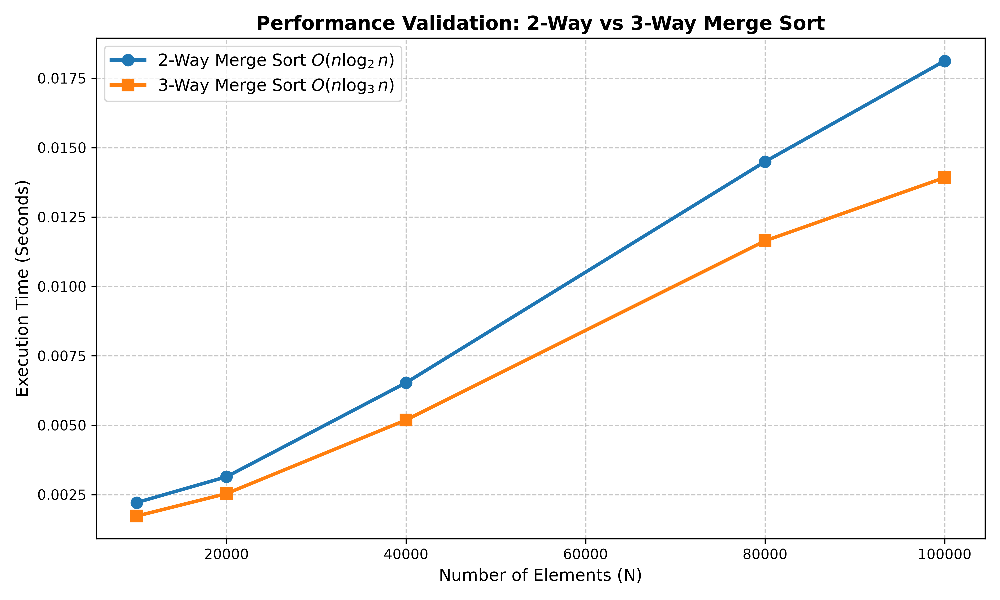

# Lab 2 - Question 2: Merge Sort vs Modified 3-Way Merge Sort

## Problem Statement
Consider a modification to the standard merge sort algorithm: divide the input array into thirds (rather than halves), recursively sort each third, and combine the results using a three-way merge subroutine. The objective is to determine the worst-case running time of this modified algorithm and validate the claim by plotting its order of growth against the standard merge sort[cite: 3].

### Folder Structure
Question_2/
├── a.out
├── q2_plot.png
├── plot_q2.py
├── q2.c
├── README.md
└── q2_merge_comparison.csv

---

## Theoretical Analysis

### 1. Standard 2-Way Merge Sort
* **Recurrence Relation:** $T(n) = 2T(n/2) + O(n)$
* **Worst-Case Time Complexity:** $O(n \log_2 n)$

### 2. Modified 3-Way Merge Sort
* **Recurrence Relation:** The array is divided into 3 sub-arrays of size $n/3$. The merging step requires comparing across 3 arrays, taking $O(n)$ time. Thus, the relation is $T(n) = 3T(n/3) + O(n)$.
* **Worst-Case Time Complexity:** Applying the Master Theorem, this resolves to $O(n \log_3 n)$[cite: 3].
* **Comparison Conclusion:** Mathematically, $\log_3 n < \log_2 n$, implying the recursion tree depth is shallower for the 3-way split. However, the dedicated 3-way merge subroutine performs strictly more comparisons per element than the 2-way merge. Consequently, the practical execution time is often very similar, or slightly slower, due to the increased constant factor overhead outweighing the reduced tree depth.

---

## Performance Validation

The C program (q2.c) executes both algorithms on identically generated random arrays of increasing sizes. The execution time is measured precisely using the <time.h> library to demonstrate the practical impact of the theoretical complexity.

---

## How to Run

To compile the C program, execute the benchmark, and generate the plots in a single step, run the following command in your terminal from inside the Question_2 directory:

gcc q2.c && ./a.out && python3 plot_q2.py