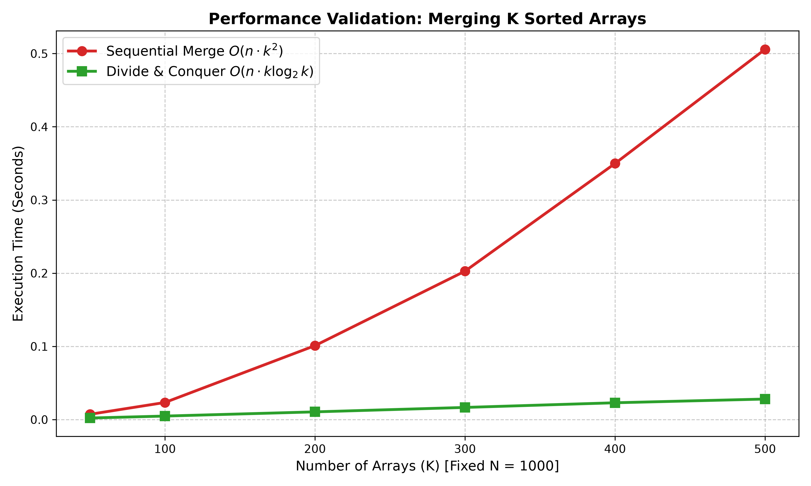

# Lab 2 - Question 3: Merging K Sorted Arrays

## Problem Statement
The objective is to compare two distinct algorithmic approaches for merging $K$ sorted arrays, each containing $N$ elements, into a single sorted output array. We evaluate the asymptotic worst-case running times of both methods and demonstrate the immense performance benefit of the Divide and Conquer strategy.

### Folder Structure
Question_3/
├── a.out
├── q3_plot.png
├── plot_q3.py
├── q3.c
├── README.md
└── q3_benchmark.csv

---

## Theoretical Analysis

### 1. Method 1: Sequential Merge
* **Logic:** The first array is merged with the second, forming an array of size $2N$. This result is merged with the third array to form a size $3N$ array, and so on.
* **Work Done:** $2N + 3N + 4N + ... + KN = N \cdot \frac{K(K+1)}{2}$
* **Worst-Case Time Complexity:** $O(N \cdot K^2)$
* **Conclusion:** The sequential approach experiences a quadratic explosion in execution time as $K$ scales, making it highly inefficient for large values of $K$.

### 2. Method 2: Divide and Conquer
* **Logic:** The arrays are paired off and merged, generating $K/2$ arrays of size $2N$. This halving process is recursively repeated (forming a binary tree structure) until one final array of size $K \cdot N$ remains.
* **Work Done:** At each level of the recursion tree, all $N \cdot K$ elements are processed. The depth of the binary tree is $\log_2 K$.
* **Worst-Case Time Complexity:** $O(N \cdot K \log_2 K)$
* **Conclusion:** This method avoids redundant operations on already merged data, scaling logarithmically relative to $K$ and drastically outperforming the sequential method.

---

## Performance Validation

The C program (q3.c) benchmarks both approaches with a fixed array size ($N = 1000$) while progressively scaling the number of arrays ($K$). The resulting execution times highlight the disparity between a quadratic curve and a linear-logarithmic curve.

---

## How to Run

To compile the C program, execute the benchmark, and generate the plots in a single step, run the following command in your terminal from inside the Question_3 directory:

gcc q3.c && ./a.out && python3 plot_q3.py